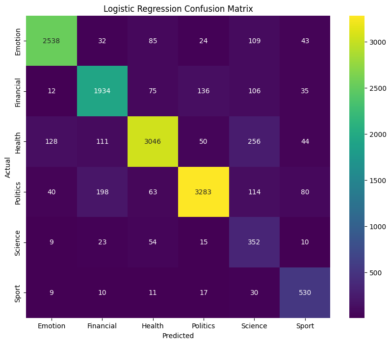
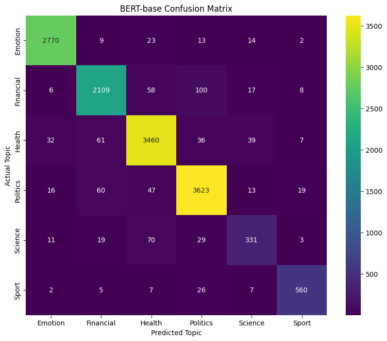
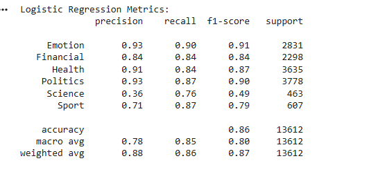
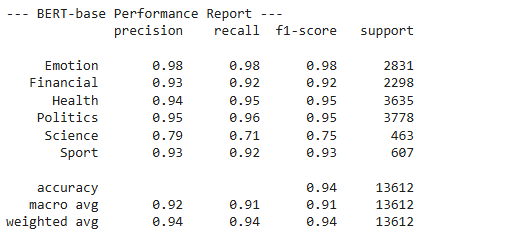

# Multi-Class News Topic Classification using NLP

This repository contains an NLP project that classifies news articles into six distinct categories. The project demonstrates the evolution from a **baseline TF-IDF + Logistic Regression model** to a **state-of-the-art BERT model** capable of understanding context and handling class imbalance effectively.

I developed a mini-project NLP pipeline to classify unstructured text into six domains. My role included handling class imbalance, data cleaning, and establishing a word-frequency baseline. I then leveraged the Hugging Face Transformers library to implement a BERT-base model, which significantly improved classification accuracy. The project was developed as part of my coursework, using concepts learned in class and supported by official documentation.

## 📂 Dataset
The dataset used in this project was sourced from **Kaggle**.  
- **Source:** [Topic Classification Dataset](https://www.kaggle.com/datasets/baraamelhem/topic-classification-dataset/data?select=topic_classification_data.csv)  
- **Categories:** Politics, Health, Emotion, Financial, Sport, Science  
- **Preprocessing:**  
  - Removed duplicate and null entries  
  - Cleaned punctuation and lowercased text  
  - Tokenized, removed stopwords, lemmatized, and rejoined tokens  
  - Vectorized using TF-IDF for Logistic Regression and tokenized with BERT tokenizer for transformer models

## 🚀 Project Overview
The goal was to build a text classification pipeline capable of distinguishing between different news topics, even when classes share overlapping vocabulary.

### **The Challenge: Class Imbalance & Keyword Overlap**
- Some categories, like Politics, contain nearly 10x more samples than minority classes such as Science or Sport.  
- Baseline models like TF-IDF + Logistic Regression often misclassified articles due to overlapping technical words (e.g., “research,” “study”) across categories.

### **The Solution: BERT + Weighted Training**
- **BERT Model:** Utilized self-attention to understand **word context** instead of relying on keyword frequency.  
- **Weighted Training:** Adjusted class weights during training to handle minority classes fairly.  
- **Efficient Training:** Mixed Precision (FP16) was used on GPU to reduce computation time.

## 📊 Results
The BERT model outperformed Logistic Regression across all metrics:

| Metric | Logistic Regression | BERT-base |
| :--- | :--- | :--- |
| Macro F1 | 0.80 | 0.91 |
| Science Precision | 0.36 | 0.79 |
| Sport F1 | 0.79 | 0.93 |

### **Confusion Matrix**
The BERT confusion matrix shows significant reductions in misclassifications, especially for minority classes like Science and Sport.

  

### **Classification reports**

  

### **Error Analysis**
BERT successfully resolved **semantic overlaps** between Health vs Science and Politics vs Science by capturing the contextual meaning of words, a limitation of the baseline model.

## 🛠️ Requirements
- Python 3.x  
- PyTorch / Torchvision  
- Transformers / Datasets / Evaluate / Accelerate  
- Scikit-learn  
- NLTK  
- Matplotlib / Seaborn  

## 📖 How to Use
1. Download the dataset from Kaggle.  
2. Ensure your dataset path matches the one used in the notebook.  
3. Run the notebook to reproduce preprocessing, baseline Logistic Regression, and BERT results.  
4. Review metrics, confusion matrices, and error analysis to understand model behavior.  

> **Note:** This notebook has been tested and runs fully on **Google Colab** with GPU acceleration. You can open it directly in Colab and reproduce all results.Also i uploaded two version ipynb and py and the both has the same code.

---

*Created as part of an NLP / AI analysis project, demonstrating progression from statistical models to transformer-based deep learning.*